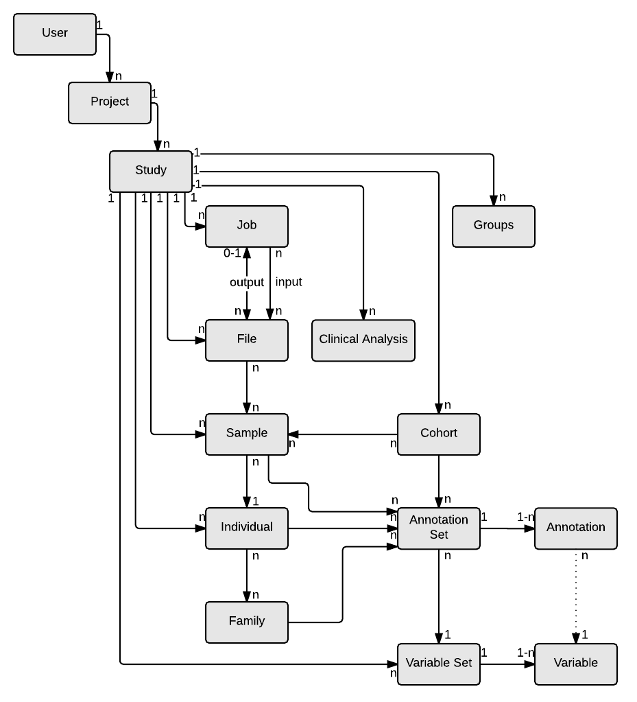

# Data Models

## Overview

This section describes the most relevant entities. For more detailed information about the data models such as _Java_ source code, examples or the _JSON Schemas_ you can visit the official [OpenCGA Catalog Data Models](https://github.com/opencb/opencga/wiki/OpenCGA-Catalog-Data-Models) code in GitHub. 

A schematic diagram with the relation between OpenCGA Catalog Data Models is shown below:  

### Catalog Entities

The most relevant entities in OpenCGA Catalog are:

* **User**:

Users represent the physical persons that are granted access to the database. Contains the data related to the user account.

**Project**

Projects represent the first physical separation of the data in OpenCGA. A Project entity contains information of a project, covering as many related studies as necessary.

**Study**

Studies represent the main space set environment. The Study is the parent of all the entities except project and user . It is important because most entities are defined at a study level \(see the diagram above\).

**File:**

Files represent the metadata about the files uploaded or linked to OpenCGA. This entity contains information regarding a submitted or generated file.

**Sample**

Information regarding the sample. Closely related to file entity.

**Individual**

 Contain the information regarding the individual from whom the sample has been taken.

**Cohort**

 Group sets of samples with some common feature\(s\).

**Disease panel:** 

Define a disease panel containing the variants, genes and/or regions of interest.

**Job**

Job analysis launched using any of the files or samples.

## Design Principles

All OpenCGA Data Models have been designed to follow a list of principles. This principles are agnostic \(not entity-dependant\) and thus apply to all the entities. Knowing these principles allows you understand the mechanism used by Catalog to represent real world clinical metadata and to infer the structure of the data associated with any entity:

1. **Parent-Child List Relationship**
2. **Chid-Parent reference**
3. **Annotation Sets:** Catalog offers the option is to define user-custom annotation sets at any entity level. 

