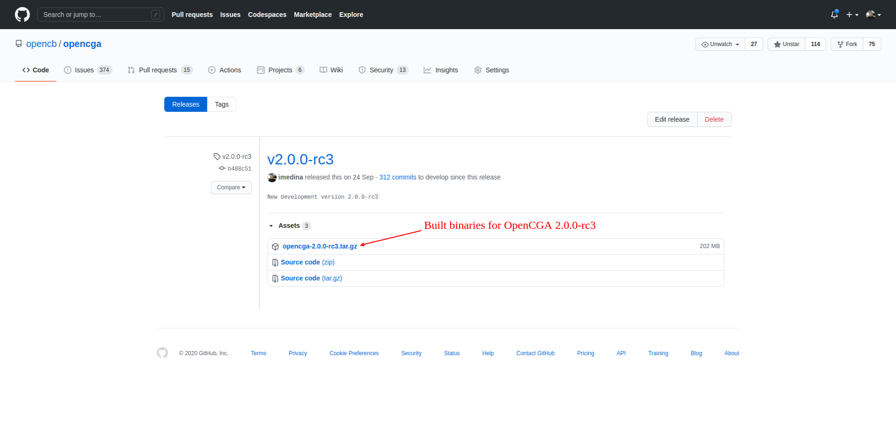

# Getting OpenCGA

## Download Binaries

You can download any _stable_ or _pre-release_ version from [OpenCGA GitHub Releases](https://github.com/opencb/opencga/releases). You will find a _tar.gz_ file with the name of _opencga_ and the _version,_ for instance, to download OpenCGA 2.0.0-rc3 you have to go to GitHub Release page at [https://github.com/opencb/opencga/releases/tag/v2.0.0-rc3](https://github.com/opencb/opencga/releases/tag/v2.0.0-rc3) and download the file _**opencga-2.0.0-rc3.tar.gz**_ from the _Assets_ section:



## Building from Source

### Prerequisites

In order to build OpenCGA from source code you must first get the source code of OpenCGA from GitHub, most of the dependencies - including OpenCB dependencies - will be fetched from [Maven Central Repository](http://search.maven.org/), however, in some scenarios, OpenCB dependencies will need to be built from GitHub source code. Compiling and building processes are carried out by [Apache Maven](https://maven.apache.org/). The following tools are required for successful build:

* Java 1.8.0\_60+
* Apache Maven

You can learn how to install them in this section at [Server Configuration](server-configuration.md).

### Getting and Compiling Dependencies

OpenCGA as any other software has dependencies, some of them come from other OpenCB projects such as CellBase while others are third-party dependencies such as MongoDB. All OpenCGA _**stable**_ releases are always merged and tagged at _**master**_ branch \(users are encouraged to use latest stable release for production\), you can find all releases at [OpenCGA Releases](https://github.com/opencb/opencga/releases). We guarantee that all the dependencies needed for building stable releases are deployed at [Maven Central Repository](http://search.maven.org/), this is true for both OpenCB and third-party dependencies. Therefore for building a stable release you only need to clone OpenCGA repository itself since all the dependencies will be fetched form Maven Central repository.

This is different for development branches. Active OpenCGA development is carried out at _**develop**_ branch, in this branch third-party dependencies will be still fetched from Maven Central Repository **but** this is not true for OpenCB dependencies since it is very likely they are still in development and therefore they are not deployed. Keep in mind that we only guarantee that _develop_ compiles and that bugs are expected, use this branch for development or for testing new functionalities. So, for building _**develop**_ branch you may require to download and install the following OpenCB repositories in this order:

* _java-common-libs:_[https://github.com/opencb/java-common-libs](https://github.com/opencb/java-common-libs) \(branch 'develop'\)
* _biodata_: [https://github.com/opencb/biodata](https://github.com/opencb/biodata) \(branch 'develop'\)
* _cellbase_: [https://github.com/opencb/cellbase](https://github.com/opencb/cellbase) \(branch 'develop'\)
* _hpg-bigdata_: [https://github.com/opencb/hpg-bigdata](https://github.com/opencb/hpg-bigdata) \(branch 'develop'\)

As you can see one of our rules is that _develop_ branch of all major applications such as OpenCGA and CellBase always depend on _develop_ branches. So, if you really want to build _develop_ the you can clone and build dependencies by executing:

```bash
## Clone develop branc
git clone -b develop https://github.com/opencb/java-common-libs.git
git clone -b develop https://github.com/opencb/biodata.git
git clone -b develop https://github.com/opencb/cellbase.git
git clone -b develop https://github.com/opencb/oskar.git

## Now you can execute the following command in each of the folders the specified order above
mvn clean install -DskipTests
```

### Clone and Build OpenCGA

You can clone OpenCGA from GitHub by executing:

```bash
## Latest stable version
git clone -b master https://github.com/opencb/opencga.git

## Develop branch, for this to work remember to clone and build OpenCB dependencies (see above)
git clone -b develop https://github.com/opencb/opencga.git
```

### Building with Maven

OpenCGA allows to customise many variables in the configuration files, in order to make easier the building and configuration of OpenCGA we rely on Maven Properties that can be defined in file _`~/.m2/settings.xml`_. During the building all these properties will be injected automatically in the configuration files so users do not have to manually change all configuration values. **Note** this is only possible when building OpenCGA from source code, if you download the binary version you will have to manually set up all configuration variables.

An example of that file can be found in the [README](https://github.com/opencb/opencga#build) and below. The description of each property can be found below:

* **OPENCGA.CATALOG.DB.HOSTS**: This property should be configured with the host and port of the MongoDB installation. By default, for development purposes, we have it set with "localhost:27017".
* **OPENCGA.CATALOG.DB.USER**: This property should only be set if the MongoDB needs authentication. In this case, this property will contain the user name with permissions for the database. \*This can be left empty in any case. The admin will be able to set this credentials using the command line.
* **OPENCGA.CATALOG.DB.PASSWORD**: This property should only be set if the MongoDB needs authentication. In this case, this property will contain the password of the user with permissions for the database. \*Like in the user property, this can be left empty. The admin will be able to set this credentials using the command line.
* **OPENCGA.INSTALLATION.DIR**: This property is extremely important when using Tomcat to deploy the webservices. This property will have to point to the final OpenCGA installation directory after everything has been built. This property will be used by Tomcat to locate the configuration files. If this is not properly set, none of the webservices will work. Default: /opt/opencga.
* **OPENCGA.USER.WORKSPACE**: In Catalog, users are allowed to build their own directory structure, upload their own files, run analysis, etc. This path should be pointing to a physical location where Catalog will be storing those files and directory structure. By default, we normally put it in a folder called "sessions" within the installation directory \(file:///opt/opencga/sessions/\).
* **OPENCGA.STORAGE.VARIANT.DB.HOSTS**:
* **OPENCGA.STORAGE.VARIANT.DB.USER**:
* **OPENCGA.STORAGE.VARIANT.DB.PASSWORD**:
* **OPENCGA.ANALYSIS.EXECUTION.MANAGER**: OpenCGA Catalog allows users to run jobs. This property indicates how the jobs will be launched. At the moment we only support two types: LOCAL to run the jobs locally in a thread or SGE to run the jobs using Sun Grid Engine. More queuing systems will be supported soon.
* **OPENCGA.CLIENT.HOST**: This property should be pointing to the URL where the webservices will be available. For development purposes, the default is [http://localhost:8080/opencga/](http://localhost:8080/opencga/). This property is read by the command line opencga.sh in order to communicate with the webservices.
* **OPENCGA.CELLBASE.REST.HOST**: URL to be used for Variant Annotation.

You can copy this example to _~/.m2/settings.xml_:

```markup
<?xml version="1.0" encoding="UTF-8"?>
<settings xmlns="http://maven.apache.org/SETTINGS/1.0.0"
  xmlns:xsi="http://www.w3.org/2001/XMLSchema-instance"
  xsi:schemaLocation="http://maven.apache.org/SETTINGS/1.0.0 http://maven.apache.org/xsd/settings-1.0.0.xsd">
    <profiles>
        <profile>
            <id>default-config</id>
            <activation>
                <activeByDefault>true</activeByDefault>
            </activation>
            <properties>
                <opencga.war.name>opencga-${opencga.version}</opencga.war.name>

                <!-- General -->
                <OPENCGA.INSTALLATION.DIR>/opt/opencga</OPENCGA.INSTALLATION.DIR>
                <OPENCGA.USER.WORKSPACE>/opt/opencga/sessions</OPENCGA.USER.WORKSPACE>
                <OPENCGA.ANALYSIS.SCRATCH.DIR></OPENCGA.ANALYSIS.SCRATCH.DIR>
                <OPENCGA.DB.PREFIX>opencga</OPENCGA.DB.PREFIX>
                <OPENCGA.EXECUTION.MODE>LOCAL</OPENCGA.EXECUTION.MODE>

                <!-- Client -->
                <OPENCGA.CLIENT.REST.HOST>http://localhost:9090/${opencga.war.name}</OPENCGA.CLIENT.REST.HOST>
                <OPENCGA.CLIENT.GRPC.HOST>localhost:9091</OPENCGA.CLIENT.GRPC.HOST>

                <OPENCGA.SERVER.REST.PORT>9090</OPENCGA.SERVER.REST.PORT>
                <OPENCGA.SERVER.GRPC.PORT>9091</OPENCGA.SERVER.GRPC.PORT>
                <OPENCGA.MONITOR.PORT>9092</OPENCGA.MONITOR.PORT>

                <!-- Catalog -->
                <OPENCGA.CATALOG.DB.HOSTS>localhost:27017</OPENCGA.CATALOG.DB.HOSTS>
                <OPENCGA.CATALOG.DB.USER></OPENCGA.CATALOG.DB.USER>
                <OPENCGA.CATALOG.DB.PASSWORD></OPENCGA.CATALOG.DB.PASSWORD>
                <OPENCGA.CATALOG.DB.AUTHENTICATION_DATABASE></OPENCGA.CATALOG.DB.AUTHENTICATION_DATABASE>
                <OPENCGA.CATALOG.DB.CONNECTIONS_PER_HOST>20</OPENCGA.CATALOG.DB.CONNECTIONS_PER_HOST>
                <OPENCGA.CATALOG.SEARCH.HOST>http://localhost:8983/solr/</OPENCGA.CATALOG.SEARCH.HOST>
                <OPENCGA.CATALOG.SEARCH.TIMEOUT>30000</OPENCGA.CATALOG.SEARCH.TIMEOUT>
                <OPENCGA.CATALOG.SEARCH.BATCH>2000</OPENCGA.CATALOG.SEARCH.BATCH>

                <!-- Storage -->
                <OPENCGA.STORAGE.DEFAULT_ENGINE>mongodb</OPENCGA.STORAGE.DEFAULT_ENGINE>
                <OPENCGA.STORAGE.CACHE.HOST>localhost:6379</OPENCGA.STORAGE.CACHE.HOST>

                <!-- Storage Variants general -->
                <OPENCGA.STORAGE.VARIANT.DB.HOSTS>localhost:27017</OPENCGA.STORAGE.VARIANT.DB.HOSTS>
                <OPENCGA.STORAGE.VARIANT.DB.USER></OPENCGA.STORAGE.VARIANT.DB.USER>
                <OPENCGA.STORAGE.VARIANT.DB.PASSWORD></OPENCGA.STORAGE.VARIANT.DB.PASSWORD>
                <OPENCGA.STORAGE.SEARCH.HOST>http://localhost:8983/solr/</OPENCGA.STORAGE.SEARCH.HOST>
                <OPENCGA.STORAGE.SEARCH.CONFIG_SET>opencga-variant-configset-${opencga.version}</OPENCGA.STORAGE.SEARCH.CONFIG_SET>
                <OPENCGA.STORAGE.SEARCH.TIMEOUT>30000</OPENCGA.STORAGE.SEARCH.TIMEOUT>
                <OPENCGA.STORAGE.CLINICAL.HOST>http://localhost:8983/solr/</OPENCGA.STORAGE.CLINICAL.HOST>
                <OPENCGA.STORAGE.CLINICAL.MANAGER>""</OPENCGA.STORAGE.CLINICAL.MANAGER>
                <OPENCGA.STORAGE.CLINICAL.TIMEOUT>30000</OPENCGA.STORAGE.CLINICAL.TIMEOUT>

                <!-- Storage Alignments general -->
                <OPENCGA.STORAGE.ALIGNMENT.DB.HOSTS>localhost:27017</OPENCGA.STORAGE.ALIGNMENT.DB.HOSTS>
                <OPENCGA.STORAGE.ALIGNMENT.DB.USER></OPENCGA.STORAGE.ALIGNMENT.DB.USER>
                <OPENCGA.STORAGE.ALIGNMENT.DB.PASSWORD></OPENCGA.STORAGE.ALIGNMENT.DB.PASSWORD>

                <!-- Storage-mongodb -->
                <OPENCGA.STORAGE.MONGODB.VARIANT.DB.AUTHENTICATION_DATABASE></OPENCGA.STORAGE.MONGODB.VARIANT.DB.AUTHENTICATION_DATABASE>
                <OPENCGA.STORAGE.MONGODB.VARIANT.DB.CONNECTIONS_PER_HOST>20</OPENCGA.STORAGE.MONGODB.VARIANT.DB.CONNECTIONS_PER_HOST>

                <!-- Storage-hadoop -->
                <OPENCGA.STORAGE.HADOOP.VARIANT.DB.USER></OPENCGA.STORAGE.HADOOP.VARIANT.DB.USER>
                <OPENCGA.STORAGE.HADOOP.VARIANT.DB.PASSWORD></OPENCGA.STORAGE.HADOOP.VARIANT.DB.PASSWORD>
                <OPENCGA.STORAGE.HADOOP.VARIANT.HBASE.NAMESPACE></OPENCGA.STORAGE.HADOOP.VARIANT.HBASE.NAMESPACE>

                <!-- Email server -->
                <OPENCGA.MAIL.HOST></OPENCGA.MAIL.HOST>
                <OPENCGA.MAIL.PORT></OPENCGA.MAIL.PORT>
                <OPENCGA.MAIL.USER></OPENCGA.MAIL.USER>
                <OPENCGA.MAIL.PASSWORD></OPENCGA.MAIL.PASSWORD>

                <!-- cellbase -->
                <OPENCGA.CELLBASE.REST.HOST>https://ws.opencb.org/cellbase/</OPENCGA.CELLBASE.REST.HOST>
                <OPENCGA.CELLBASE.VERSION>v4</OPENCGA.CELLBASE.VERSION>
            </properties>
        </profile>
    </profiles>
</settings>
```

After creating this and configuring a default profile, you can build OpenCGA by executing the following command from the root of the cloned repository:

```bash
$ mvn clean install -DskipTests
```

The first time this command can take some minutes since it has to fetched and store locally all the dependencies, the next builds will be much faster. After successful building, user should find the following file structure under a build folder:

```bash
build/
├── analysis
│   ├── clinical-variant-query.yml
│   ├── individual-qc
│   ├── interpretation-zetta
│   ├── R
│   └── resources
├── bin
│   ├── opencga-admin.sh
│   ├── opencga-internal.sh
│   ├── opencga.sh
│   └── utils
├── clients
│   ├── python
│   └── R
├── cloud
│   ├── aws
│   ├── azure
│   ├── docker
│   └── kubernetes
├── conf
│   ├── client-configuration.yml
│   ├── configuration.yml
│   ├── hadoop
│   ├── log4j2.internal.xml
│   ├── log4j2.service.xml
│   ├── log4j2.xml
│   ├── opencga-env.sh
│   └── storage-configuration.yml
├── libs
│   ├── accessors-smart-1.2.jar
│   ├── activation-1.1.jar
│   ├── adal4j-1.6.3.jar
│   ├── adapter-rxjava-2.4.0.jar
│   ├── animal-sniffer-annotations-1.17.jar
│   ├── annotations-2.0.1.jar
│   ├── annotations-4.1.1.4.jar
│   ├── ant-1.8.2.jar
│   ├── ant-launcher-1.8.2.jar
│   ├── aopalliance-repackaged-2.5.0-b32.jar
│   ├── asm-5.0.4.jar
│   ├── automaton-1.11-8.jar
│   ├── avro-1.7.7.jar
│   ├── avro-ipc-1.7.7.jar
│   ├── azure-1.13.0.jar
│   ├── azure-annotations-1.2.0.jar
│   ├── azure-batch-4.0.1.jar
│   ├── azure-client-authentication-1.5.4.jar
│   ├── azure-client-runtime-1.6.4.jar
│   ├── azure-keyvault-1.0.0.jar
│   ├── azure-keyvault-core-0.8.0.jar
│   ├── azure-keyvault-webkey-1.0.0.jar
│   ├── azure-mgmt-appservice-1.13.0.jar
│   ├── azure-mgmt-batch-1.13.0.jar
│   ├── azure-mgmt-batchai-1.13.0.jar
│   ├── azure-mgmt-cdn-1.13.0.jar
│   ├── azure-mgmt-compute-1.13.0.jar
│   ├── azure-mgmt-containerinstance-1.13.0.jar
│   ├── azure-mgmt-containerregistry-1.13.0.jar
│   ├── azure-mgmt-containerservice-1.13.0.jar
│   ├── azure-mgmt-cosmosdb-1.13.0.jar
│   ├── azure-mgmt-dns-1.13.0.jar
│   ├── azure-mgmt-eventhub-1.13.0.jar
│   ├── azure-mgmt-graph-rbac-1.13.0.jar
│   ├── azure-mgmt-keyvault-1.13.0.jar
│   ├── azure-mgmt-locks-1.13.0.jar
│   ├── azure-mgmt-monitor-1.13.0.jar
│   ├── azure-mgmt-msi-1.13.0.jar
│   ├── azure-mgmt-network-1.13.0.jar
│   ├── azure-mgmt-redis-1.13.0.jar
│   ├── azure-mgmt-resources-1.13.0.jar
│   ├── azure-mgmt-search-1.13.0.jar
│   ├── azure-mgmt-servicebus-1.13.0.jar
│   ├── azure-mgmt-sql-1.13.0.jar
│   ├── azure-mgmt-storage-1.13.0.jar
│   ├── azure-mgmt-trafficmanager-1.13.0.jar
│   ├── azure-storage-6.1.0.jar
│   ├── BigWig-1.0.jar
│   ├── biodata-formats-2.0.4.jar
│   ├── biodata-models-2.0.4.jar
│   ├── biodata-tools-2.0.4.jar
│   ├── biojava-alignment-4.1.0.jar
│   ├── biojava-core-4.1.0.jar
│   ├── biojava-phylo-4.1.0.jar
│   ├── caffeine-2.6.1.jar
│   ├── cellbase-client-4.8.0.jar
│   ├── cellbase-core-4.8.0.jar
│   ├── client-runtime-1.6.4.jar
│   ├── commons-codec-1.11.jar
│   ├── commons-collections-3.2.1.jar
│   ├── commons-compress-1.4.1.jar
│   ├── commons-datastore-core-4.0.4-20201126.222923-7.jar
│   ├── commons-datastore-mongodb-4.0.4-20201126.222937-7.jar
│   ├── commons-datastore-solr-4.0.4-20201126.222939-7.jar
│   ├── commons-io-2.5.jar
│   ├── commons-jexl-2.1.1.jar
│   ├── commons-lang-2.4.jar
│   ├── commons-lang3-3.8.1.jar
│   ├── commons-lib-4.0.4-20201126.222926-5.jar
│   ├── commons-logging-1.2.jar
│   ├── commons-math3-3.6.1.jar
│   ├── commons-rdf-api-0.5.0.jar
│   ├── converter-jackson-2.4.0.jar
│   ├── error_prone_annotations-2.3.2.jar
│   ├── forester-1.005.jar
│   ├── ga4gh-0.6.0a5.jar
│   ├── generex-1.0.2.jar
│   ├── google-auth-library-credentials-0.13.0.jar
│   ├── grpc-all-1.23.0.jar
│   ├── grpc-api-1.23.0.jar
│   ├── grpc-auth-1.23.0.jar
│   ├── grpc-context-1.23.0.jar
│   ├── grpc-core-1.23.0.jar
│   ├── grpc-netty-1.23.0.jar
│   ├── grpc-okhttp-1.23.0.jar
│   ├── grpc-protobuf-1.23.0.jar
│   ├── grpc-protobuf-lite-1.23.0.jar
│   ├── grpc-stub-1.23.0.jar
│   ├── grpc-testing-1.23.0.jar
│   ├── gson-2.8.0.jar
│   ├── guava-19.0.jar
│   ├── hk2-api-2.5.0-b32.jar
│   ├── hk2-locator-2.5.0-b32.jar
│   ├── hk2-utils-2.5.0-b32.jar
│   ├── hppcrt-0.7.5.jar
│   ├── htsjdk-2.21.3.jar
│   ├── http2-client-9.4.19.v20190610.jar
│   ├── http2-common-9.4.19.v20190610.jar
│   ├── http2-hpack-9.4.19.v20190610.jar
│   ├── http2-http-client-transport-9.4.19.v20190610.jar
│   ├── httpclient-4.5.6.jar
│   ├── httpcore-4.4.10.jar
│   ├── httpmime-4.5.6.jar
│   ├── jackson-annotations-2.10.1.jar
│   ├── jackson-core-2.10.1.jar
│   ├── jackson-core-asl-1.9.13.jar
│   ├── jackson-databind-2.10.1.jar
│   ├── jackson-dataformat-cbor-2.10.1.jar
│   ├── jackson-dataformat-yaml-2.10.1.jar
│   ├── jackson-datatype-joda-2.10.1.jar
│   ├── jackson-jaxrs-base-2.10.1.jar
│   ├── jackson-jaxrs-json-provider-2.10.1.jar
│   ├── jackson-mapper-asl-1.9.13.jar
│   ├── jackson-module-jaxb-annotations-2.10.1.jar
│   ├── jakarta.activation-api-1.2.1.jar
│   ├── jakarta.xml.bind-api-2.3.2.jar
│   ├── jansi-1.18.jar
│   ├── javassist-3.20.0-GA.jar
│   ├── javax.annotation-api-1.2.jar
│   ├── javax.el-3.0.1-b11.jar
│   ├── javax.inject-1.jar
│   ├── javax.inject-2.5.0-b32.jar
│   ├── javax.mail-1.6.1.jar
│   ├── javax.servlet-api-3.1.0.jar
│   ├── javax.ws.rs-api-2.0.1.jar
│   ├── jcip-annotations-1.0-1.jar
│   ├── jcl-over-slf4j-1.7.24.jar
│   ├── jcommander-1.64.jar
│   ├── jersey-client-2.25.1.jar
│   ├── jersey-common-2.25.1.jar
│   ├── jersey-container-servlet-2.25.1.jar
│   ├── jersey-container-servlet-core-2.25.1.jar
│   ├── jersey-entity-filtering-2.25.1.jar
│   ├── jersey-guava-2.25.1.jar
│   ├── jersey-media-jaxb-2.25.1.jar
│   ├── jersey-media-json-jackson-2.25.1.jar
│   ├── jersey-media-multipart-2.25.1.jar
│   ├── jersey-server-2.25.1.jar
│   ├── jetty-6.1.26.jar
│   ├── jetty-alpn-client-9.4.17.v20190418.jar
│   ├── jetty-alpn-java-client-9.4.17.v20190418.jar
│   ├── jetty-client-9.4.17.v20190418.jar
│   ├── jetty-http-9.4.17.v20190418.jar
│   ├── jetty-io-9.4.17.v20190418.jar
│   ├── jetty-security-9.4.17.v20190418.jar
│   ├── jetty-server-9.4.17.v20190418.jar
│   ├── jetty-servlet-9.4.17.v20190418.jar
│   ├── jetty-util-6.1.26.jar
│   ├── jetty-util-9.4.17.v20190418.jar
│   ├── jetty-webapp-9.4.17.v20190418.jar
│   ├── jetty-xml-9.4.17.v20190418.jar
│   ├── jjwt-0.9.1.jar
│   ├── joda-time-2.1.jar
│   ├── json-smart-2.3.jar
│   ├── jsr305-3.0.2.jar
│   ├── jul-to-slf4j-1.7.26.jar
│   ├── kryo-2.23.0.jar
│   ├── kubernetes-client-4.3.0.jar
│   ├── kubernetes-model-4.3.0.jar
│   ├── kubernetes-model-common-4.3.0.jar
│   ├── lang-tag-1.5.jar
│   ├── log4j-api-2.13.3.jar
│   ├── log4j-core-2.13.3.jar
│   ├── log4j-slf4j-impl-2.13.3.jar
│   ├── logging-interceptor-3.12.0.jar
│   ├── mail-1.4.7.jar
│   ├── microsoft-graph-1.4.0.jar
│   ├── mimepull-1.9.6.jar
│   ├── minlog-1.2.jar
│   ├── mongo-java-driver-3.11.2.jar
│   ├── netty-3.4.0.Final.jar
│   ├── netty-buffer-4.1.29.Final.jar
│   ├── netty-codec-4.1.29.Final.jar
│   ├── netty-codec-http2-4.1.38.Final.jar
│   ├── netty-codec-http-4.1.38.Final.jar
│   ├── netty-codec-socks-4.1.38.Final.jar
│   ├── netty-common-4.1.29.Final.jar
│   ├── netty-handler-4.1.29.Final.jar
│   ├── netty-handler-proxy-4.1.38.Final.jar
│   ├── netty-resolver-4.1.29.Final.jar
│   ├── netty-transport-4.1.29.Final.jar
│   ├── netty-transport-native-epoll-4.1.29.Final.jar
│   ├── netty-transport-native-unix-common-4.1.29.Final.jar
│   ├── ngs-java-2.9.0.jar
│   ├── nimbus-jose-jwt-9.1.3.jar
│   ├── oauth2-oidc-sdk-5.64.4.jar
│   ├── objenesis-2.1.jar
│   ├── okhttp-2.5.0.jar
│   ├── okhttp-3.12.0.jar
│   ├── okhttp-urlconnection-3.11.0.jar
│   ├── okio-1.15.0.jar
│   ├── opencensus-api-0.21.0.jar
│   ├── opencensus-contrib-grpc-metrics-0.21.0.jar
│   ├── opencga-analysis-2.0.0.jar
│   ├── opencga-app-2.0.0.jar
│   ├── opencga-catalog-2.0.0.jar
│   ├── opencga-client-2.0.0.jar
│   ├── opencga-core-2.0.0.jar
│   ├── opencga-master-2.0.0.jar
│   ├── opencga-server-2.0.0.jar
│   ├── opencga-storage-app-2.0.0.jar
│   ├── opencga-storage-core-2.0.0.jar
│   ├── opencga-storage-mongodb-2.0.0.jar
│   ├── opencga-storage-server-2.0.0.jar
│   ├── osgi-resource-locator-1.0.1.jar
│   ├── oskar-analysis-0.2.0-20191017.131623-2.jar
│   ├── oskar-core-0.2.0-20191017.131625-2.jar
│   ├── owlapi-api-5.1.13.jar
│   ├── owlapi-oboformat-5.1.13.jar
│   ├── owlapi-parsers-5.1.13.jar
│   ├── paranamer-2.3.jar
│   ├── perfmark-api-0.17.0.jar
│   ├── protobuf-java-3.9.0.jar
│   ├── protobuf-java-util-3.9.0.jar
│   ├── proto-google-common-protos-1.12.0.jar
│   ├── reactive-streams-1.0.0.jar
│   ├── reactor-core-2.0.7.RELEASE.jar
│   ├── reactor-stream-2.0.7.RELEASE.jar
│   ├── redisson-2.2.0.jar
│   ├── reflections-0.9.10.jar
│   ├── retrofit-2.4.0.jar
│   ├── rocksdbjni-4.5.1.jar
│   ├── rxjava-1.2.4.jar
│   ├── slf4j-api-1.7.25.jar
│   ├── snakeyaml-1.24.jar
│   ├── snappy-java-1.0.5.jar
│   ├── solr-solrj-8.4.1.jar
│   ├── stax2-api-3.1.4.jar
│   ├── swagger-annotations-1.5.22.jar
│   ├── swagger-core-1.5.22.jar
│   ├── swagger-jaxrs-1.5.22.jar
│   ├── swagger-jersey2-jaxrs-1.5.22.jar
│   ├── swagger-models-1.5.22.jar
│   ├── validation-api-1.1.0.Final.jar
│   ├── velocity-1.7.jar
│   ├── woodstox-core-asl-4.4.1.jar
│   ├── xz-1.8.jar
│   ├── zjsonpatch-0.3.0.jar
│   ├── zookeeper-3.5.5.jar
│   └── zookeeper-jute-3.5.5.jar
├── LICENSE
├── misc
│   ├── catalog
│   ├── clients
│   ├── completion
│   ├── demo
│   ├── examples
│   ├── migration
│   ├── scripts
│   └── solr
├── monitor
│   └── README.md
├── opencga-client-2.0.0.tar.gz
├── opencga.war
├── README.md
└── test
    ├── bin
    ├── dependencies
    ├── fitnesse
    └── README.md

32 directories, 257 files
```

