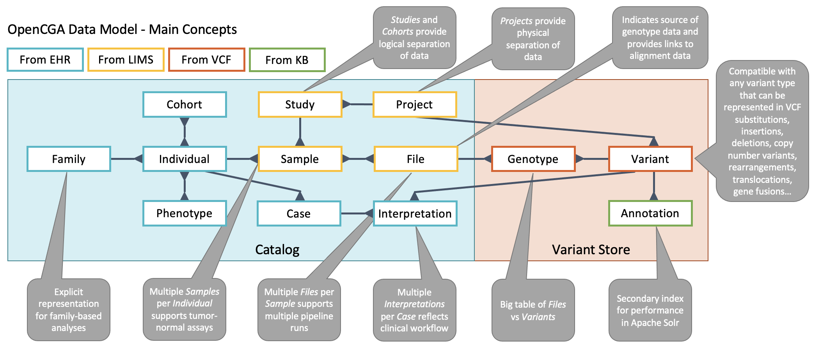

# Data Management

This section provides instructions on how data is managed \(loaded, updated, removed\) in OpenCGA.

1. [Working with Projects and Studies](../data-management-1/projects-and-studies.md)
2. [Loading of VCF files](../data-management-1/ingestion-of-vcf-files.md)
3. [Working with metadata](../data-management-1/working-with-files.md)
4. [Controlling access and setting permissions](../data-management-1/sharing-and-permissions/)  
5. [Data versioning](../data-management-1/data-versioning.md)

