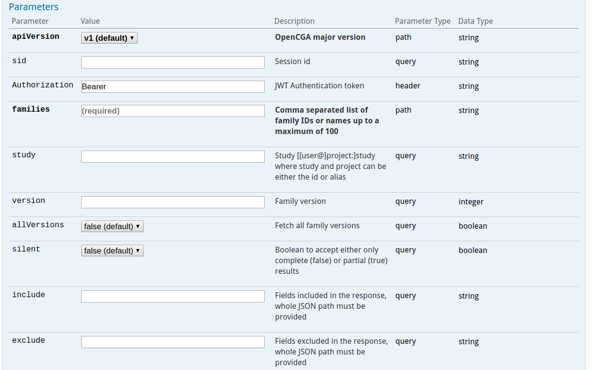

# REST Web Service API

## REST API Design

### Understanding the URL

The general format of the REST API web services is:

```http
https://HOST_URL/APPLICATION/webservices/rest/{apiVersion}/{resource}/{ids}/{endpoint}?{options}
```

where **HOST\_URL** is the URL pointing to the host server and **APPLICATION** is the name of Java _**war**_ file deployed in web server \(eg. Tomcat\), for example, [http://bioinfo.hpc.cam.ac.uk/opencga-prod/](http://bioinfo.hpc.cam.ac.uk/opencga-prod/)

Entities inside the curly braces `{ }` are the web service parameters, and they are treated as variables. For example the following URL:

```http
http://bioinfo.hpc.cam.ac.uk/opencga-prod/webservices/rest/v1/samples/HG01879,HG01880/info?study=1000g
```

As it is explained later in this documentation, this RESTful web service will return the information stored in OpenCGA of the user _**demo**_.

* **apiVersion \(**v2**\):** indicates OpenCGA version to retrieve information from, data models and API may change between versions. 
* **resource:** specifies the data type of what the user wants to query by, in this example the resources are _samples_. This is one of the different _resources_ listed below. \_\_
* **id:** the ID of the resources we want to query by_._ In this example are HG01879 and HG01880. Path parameters are limited to 100 IDs.
* **endpoint \(**info**\):** these parameters must be specified depending on the nature of your input data. For instance, info is used to fetch the information stored in the database regarding the id's passed.
* **options \(**study=1000g**\) :** variables in key-value pair form, passed as query parameters. 

### REST Params

#### _apiVersion_

_apiVersions_ are numbered as _v1_, _v2_, etc. At this moment we are heading to the second stable _apiVersion_ which will be _**v2**_.

#### resource

There are several metadata _resources_ implemented such as _users, samples, individuals,_ ... see below for more info.

#### _IDs_

This is the unique identifier\(s\) corresponding to the _resource_ we want to interact with. Plural means a comma-separated list of IDs can be passed to improve performance with a single REST call rather than multiple calls. OpenCGA preserves the order of the results with corresponding IDs. A Boolean variable, **silent,** can be set to indicate, in case of a failure \(resource doesn't exist, permission denied, etc\), whether the user is interested in receiving partial results \(true\) with the information that could be successfully retrieved or just a failure with no results. As a trade-off between performance and ease of use a maximum of **100** IDs are allowed in one web service.

#### _options_

These query parameters can modify the behavior of the query \(_exclude_, _include_, _limit_, _skip_ and _count_\) or add some filters to some specific endpoints to add useful functionality. The following image shows some typical options for a certain web service.



## REST Response

### OpenCGA 2.x


Note that the **Response** object has changed in OpenCGA 2.0


REST web services return the response wrapped in a _**RestResponse**_ object \([view data model](https://github.com/opencb/opencga/blob/develop/opencga-core/src/main/java/org/opencb/opencga/core/response/RestResponse.java)\). This consists of some _metadata_ and a list of _**OpenCGAResult**_ objects \([view data model](https://github.com/opencb/opencga/blob/develop/opencga-core/src/main/java/org/opencb/opencga/core/response/OpenCGAResult.java)\) called _**responses**_ containing the data _**results**_ and _metadata_ requested. The first response of the list will always contain the response of the OpenCGA federation being directly queried. Any additional response in the list will belong to other federated servers that could be connected. Each federated response will contain a list of _**results**_ **\*\*\(\_**OpenCGAResult\*\*\_\) containing the data that has been queried.

```javascript
{
  "apiVersion": "v2",
  "time": 23,
  "params": {
    "include": "id",
    "study": "study1",
    "limit": "3"
  },
  "events": [
    {
      "type": "WARNING",
      "message": "This is a development version OpenCGA 2.0.0-RC"
    }
  ],
  "responses": [
    {
      "time": 16,
      "events": [],
      "numResults": 3,
      "results": [
        {
          "id": "HG01879"
        },
        {
          "id": "HG01880"
        },
        {
          "id": "HG01881"
        }
      ],
      "resultType": "org.opencb.opencga.core.models.Sample",
      "numMatches": 3502,
      "numInserted": 0,
      "numUpdated": 0,
      "numDeleted": 0
    }
  ]
}
```

where:

* **Line 1**: single _RestResponse_ object
* **Lines 2 and 3**: show the version and the duration time \(ms\)
* **Lines 4-8**: show all the parameters that have been provided.
* **Line 9-14:** show an events array where _info, warning_ and _error_ messages will be shown: For instance, when having network issues you could get "Catalog database not accessible".
* **Line 15**: list of _DataResults_ called _**responses**_. In this example, because federation is disabled, it only contains a single _DataResult._
* **Line 17**: database duration time \(ms\) for each _DataResult._
* **Line 18**: list of _events_ where _info, warning_ and _error_ messages will be shown. For instance, it can show messages such as "Permission denied to access sample xxx". \_\_
* **Line 19**: number of elements returned in the _**results**_ list. 
* **Line 20-30**: List of _**results**_ for this query.
* **Line 31**: resource type of _**results**_.
* **Line 32**: total number of records found in the database for the given query.
* **Line 33-35**: Number of elements inserted, updated and deleted in the database. These counters only make sense for _create, updated_ and _delete_ operations.

### OpenCGA 1.x

Most web services return the results encapsulated in a single _**QueryResponse**_ object \([view data model](https://github.com/opencb/java-common-libs/blob/develop/commons-datastore/commons-datastore-core/src/main/java/org/opencb/commons/datastore/core/QueryResponse.java)\) consisting of some metadata and a list of _**QueryResult**_ objects \([view data model](https://github.com/opencb/java-common-libs/blob/develop/commons-datastore/commons-datastore-core/src/main/java/org/opencb/commons/datastore/core/QueryResult.java)\) called _**response**_ containing the data and metadata requested. The reason for this two-level response is that some REST web services allow to pass multiple IDs as input parameter, this improves significantly the performance by reducing the number of calls, for instance a calling _**/info**_ method with three sample IDs will return a _**QueryResponse**_ object with three **QueryResults**_**.**_ Then, each _**QueryResult**_ can contain multiple _**results,**_ for instance when getting all samples from an individual or when fetching all variants from a gene.

However, most of the web services will return a _**QueryResponse**_ with one single _**QueryResult**_ with one or more _**result.**_ In general the response object looks like:

```javascript
{
  "apiVersion": "v1",
  "time": 19,
  "warning": "",
  "error": "",
  "queryOptions": {
    "metadata": true,
    "skipCount": false,
    "limit": 10
  },
  "response": [
    {
      "id": "search",
      "dbTime": 18,
      "numResults": 10,
      "numTotalResults": 56,
      "warningMsg": "",
      "errorMsg": "",
      "resultType": "",
      "result": [
        {
            // result 1
        },
        {
            // result 2
        },
        // ...
        {
            // result 10
        }
      ]
    }
  ]
}
```

where:

* **Line 1**: single _QueryResponse_ object
* **Lines 2 and 3**: show the version and the duration time \(ms\)
* **Lines 4 and 5**: show warning and error messages, for instance when having network issues you could get "Catalog database not accessible"
* **Line 6**: summary of all option parameters provided
* **Line 11**: list of _QueryResults_ called _**response**_. In this example, and in most of calls, there is only one _QueryResult_.
* **Line 14**: database duration time \(ms\) for each _QueryResult._
* **Line 15 and 16**: number of elements returned in the list _**result**_ \(see below\) and total number of records found in the database for a given query.
* **Line 17 and 18**: specific warning and error messages for each QueryResult
* **Line 19**: type of result such as resource.
* **Line 20**: list of results for this query, this can be _samples, variants,_ ...

## Resources and Endpoints

REST API is organised into two main groups of web services, one to work with metadata and a different one to run some analyses: _**Catalog**_ and _**Analysis**_. See below a description of the web services.

### Catalog Web Services

Contains all endpoints for managing and querying metadata and permission.

| Resource | Path | Description | Main Endpoints |
| :--- | :--- | :--- | :--- |
| Users | /users | Different methods to work with users | info, create, login, ... |
| Projects | /projects | Projects are defined for each user and contains studies | info, create, studies, ... |
| Studies | /studies | Studies are the main component of OpenCGA Catalog. They can be shared with other users and are the containers of the data \(files, samples, cohorts, jobs...\). | info, create, groups, ... |
| Files | /files | Files are added to the study and can be indexed to be queried | info, create, index, share, ... |
| Jobs | /jobs | Jobs are used to execute analyses. | info, create, ... |
| Families | /families | Family is a connected collection of individuals based on their relationship. | info, create, ... |
| Individuals | /individuals | Individual is the member from which a sample was taken. | info, create, ... |
| Samples | /samples | Samples are each of the experiment samples, typically matches a NGS BAM file or VCF sample. | info, create, annotate, share, ... |
| Cohorts | /cohorts | Cohort is a group of samples that share some common properties. These are used for data analysis. | info, create, stats, samples, ... |
| Clinical Analysis | /clinical | This handles creating and search of a clinical analyses. | info, create, ... |
| Meta | /meta | Contains basic information about the status of an OpenCGA installation instance. | ping, about, status |
| GA4GH | /ga4gh | GA4GH standard web services to search genomics data in OpenCGA | variant search, reads search, responses |

### Analysis Web Services

Different endpoint for running the alignment, variant and clinical analysis

| Category | Path | Description | Main Endpoints |
| :--- | :--- | :--- | :--- |
| Alignment Analysis | /analysis/alignment | Operations over Read Alignments to facilitate complete analysis with different tools. | index, query, stats, coverage |
| Variant Analysis | /analysis/variant | Operations over Genomic Variants to facilitate complete analysis with different tools. | index, stats, query, validate, ibs, facet, samples, metadata |
| Clinical Analysis | /analysis/clinical | You can manage Clinical Analysis metadata \(e.g create a case, set permissions\) or run a genome interpretation | execute |

### Swagger

OpenCGA has been documented using [Swagger](http://swagger.io/) project. Detailed information about _resources_, _endpoints_ and _options_ is available at:

[http://bioinfo.hpc.cam.ac.uk/opencga-demo](http://bioinfo.hpc.cam.ac.uk/opencga-demo)

## Client Libraries

Currently OpenCGA implements the following four client libraries:

1. [Java](http://docs.opencb.org/display/opencga/Java)
2. [Python](http://docs.opencb.org/display/opencga/Python)
3. [R](http://docs.opencb.org/display/opencga/R)
4. [JavaScript](http://docs.opencb.org/display/opencga/JavaScript)

## Deprecation Policy

Certain APIs are deprecated over the period of time as OpenCGA is a live project and continuously improved and new features are implemented. The deprecation cycle consists of a **warning** period to let make the user aware that these services are considered for change and highly likely will be replaced followed by a **deprecated** message**.** OpenCGA supports deprecated services for two releases \(Deprecated and Next one\). Deprecated services are hidden from Swagger in the following release and completely removed in the next one.

```javascript
Warning (working) --> Deprecated (working) --> Hidden (working) --> Removed (not working)
```

