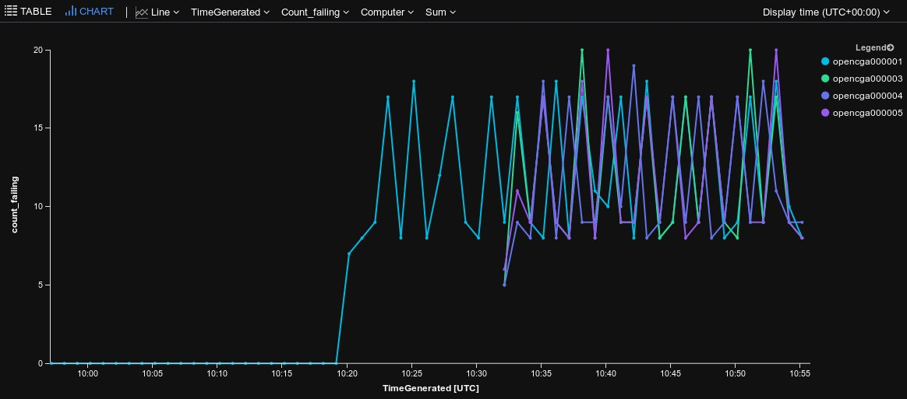

# ARM Templates and Deploying OpenCGA to Azure

This document contains information related to the deployment of OpenCGA to Azure using ARM automation scripts.

## Deploy to Azure

### With the Portal

Click the following link the ensure you fill in the parameters according to their descriptions.

<a href="https://portal.azure.com/#create/Microsoft.Template/uri/https%3A%2F%2Fraw.githubusercontent.com%2Fopencb%2Fopencga%2Fazure%2Fopencga-app%2Fapp%2Fscripts%2Fazure%2Farm%2Fazuredeploy.json" target="_blank">
    
</a>

### With `az cli`

1. Clone the repository and move into the `ARM` directory with `cd ./opencga-app/app/scripts/azure/arm`. 
2. Using your editor fill in the `azuredeploy.parameters.json` with the required parameters
   > Note: `_artifactsLocation` should be set to the correct `raw.github.com` address for the branch you want to deploy. For example, use `https://raw.githubusercontent.com/opencb/opencga/azure/opencga-app/app/scripts/azure/arm/` to deploy the `azure` branch or `https://raw.githubusercontent.com/opencb/opencga/dev/opencga-app/app/scripts/azure/arm/` to deploy the `dev` branch.
3. Run `az deployment create --location northeurope --template-file azuredeploy.json --parameters @azuredeploy.parameters.json --name MyDeploymentNameHere --parameters`

## Deploying with external NFS server

The template support deploying with an external NFS by setting the following. 

1. Deploy the `VNET` template without the `OpenCGA` application. Replace `<rgPrefix>` and `<deploymentLocation>` with the value you will use for the resource group name and it's location.

```
cd ./opencga-app/app/scripts/azure/arm/
az group create --name <rgPrefix> --location <deploymentLocation>
az group deployment create -g <rgPrefix> --template-file ./vnet/azuredeploy.json
```

2. 
     - Option 1: Use [peering](https://docs.microsoft.com/en-us/azure/virtual-network/virtual-network-peering-overview) to connect it to your existing NFS server on another `VNET`. Ensure the `VNET`s IP ranges don't overlap - OpenCGA uses `10.0.0.0/16`.
    
     - Option 2: Deploy your NFS servers into the now created VNET. In the resource group created by Step 1 there is a `vnet` resource and it contains a subnet for `nfsservers` in which you can deploy and configure your storage servers. For example, you may deploy an [Avere VFXT](https://docs.microsoft.com/en-gb/azure/avere-vfxt/avere-vfxt-deploy) cluster into this subnet. 

3. Deploy the full template as normal using the steps above specifying the parameters in `azuredeploy.parameters.json`

```json
        "rgPrefix": {
            "value": "<rgPrefix>"
        },
        "fileSystemType": {
            "value": "nfs"
        },
        "fileSystemParams": {
            "value": "<serverFqdnOrIP>:/<nfsSharedFolder>"
        },
        "rgLocation": {
            "value": "<deploymentLocation>"
        },
```

## How do I now use it?

Head to the Azure Portal and the Resource Group you deployed. Under the main group locate the `daemonvm-ip` resource and from it get the `ip` of the `deamonvm` you can then use `ssh opencgaadmin@DAEMONVM_PUBLIC_IP_HERE` to connect to it and then [follow the Testing guide here to](../README.md) run a test on your new instance. 

## What is deployed

The automated OpenCGA uses [docker images built here](../../docker/README.md) to setup and run Opencga in Azure. 

In a deployment the following components are deployed and configured

### Resource Group: `opencga`

This contains
 - VNET: This provides the virtual network on which the solution runs. It consists of multiple `subnets` on which different parts of the solution sit to allow simple management and configuration. 
 - OpencgaVMSS: A group of web servers running docker images for IVA and the OpenCGA API's in Tomcat
 - App Gateway: This provides the load balancing and Layer 7 routing over the VMSS instances to allow external connections to IVA and OpenCGA API's
 - Azure Monitor and Solutions: A group of logging solutions to collect and aggregate logs from accross the deployment
 - DaemonVM: This VM is responsible for doing the initial configuration of OpenCGA in Azure and then handles allocating Jobs to Azure Batch for processing
 - Azure Batch: This is elastic autoscaling pool of VMs which handle OpenCGA jobs such as the transform and load pipelines
 - [Optional] Azure Files/Storage: Hosts the storage used for `variants`, `storage` and `conf` folders shared between AzureBatch instances, Web Servers and the Daemon VM. 

### Resource Group: `opencga-hdinsights`

This resource group contains the `HDInsights` cluster (Hosted `HBASE` on Horton works). This differs from a traditional `HBASE` cluster in that the data storage is detacted from the nodes and stored 
in `Azure Data Lake` via `WebHDFS`. 

### Resource Group: `opencga-mongodb`

This resource group contains an HA mongo cluster which consists of several nodes joined into a replica set and issues with an SSL certificate from LetsEncrypt for use via SSL

### Resource Group: `opencga-solr`

This resource group contains an HA SOLR cluster used by OpenCGA for indexing the data in `HBASE`. To provide the leadership election and failover a small `zookeeper` HA deployment is also present in this resource group. 

## Debugging deployment Issues


Some failure cases will result in the CLI returning a failed deployment but others aren't detectable from the CLI in the current version. The best way to debug these further is to either connect to the `daemonvm` or review the `log analytics` data. 

### Log Analytics Checks

Under the main resource group for the deployment several `solutions` are deployed for `loganalytics`. One of particualar use [is the Container Monitoring Solution])https://docs.microsoft.com/en-us/azure/azure-monitor/insights/containers) which gives an overview of the logs, usage and status of the containers deployed in the solution.


You can also write queries to return data from nodes and containers. See [this guide for getting started](https://docs.microsoft.com/en-us/azure/azure-monitor/log-query/query-language) 

Here are some useful queries for OpenCGA:

```
ContainerLog
| where Name == "opencga-app" | where Computer == "opencga000001"
| project LogEntry, TimeOfCommand 
| order by TimeOfCommand asc
```

Will return logs from the `tomcat` service running the `opencga api` on the web server notes - these run in a [VMSS](https://docs.microsoft.com/en-us/azure/virtual-machine-scale-sets/overview).

Each of the web servers also run a health check to ensure key services are responding as expected. These can be viewed iva `loganalytics` as follows:

```
ContainerLog
| where LogEntry contains "HealthCheck :"
| extend failing = (LogEntry contains "KO")
| project TimeGenerated, Computer, Name, LogEntry, failing 
| order by TimeGenerated desc 
```

This returns the results from each node which look like `HealthCheck : {Solr=OK, CatalogMongoDB=OK, VariantStorage=OK, VariantStorageId=hadoop}`. If a failure has occurred the `OK` will be `KO`. For example, the following shows a failure talking to `hadoop`: `{Solr=OK, CatalogMongoDB=OK, VariantStorage=KO, VariantStorageId=hadoop}\n` 

We can then use `loganalytics` to graph these failures over time grouped by each web server.

```
ContainerLog
| where LogEntry contains "HealthCheck :"
| extend failing = (LogEntry contains "KO")
| project TimeGenerated, Computer, Name, LogEntry, failing 
| summarize count(failing) by Computer, bin(TimeGenerated, 5m) 
| render timechart 
```

In this example we see a failure occur around `10:20UTC` and the various web server nodes report their failures. 




### Daemon VM checks and FAQ

Q. How do I connect to the web servers hosting the `tomcat` app. 
A. You can use the `daemonvm` as a jumpbox. Retreive the `daemonvm`'s public IP from the portal and use `ssh -J opencgaadmin@DAEMONVM_PUBLIC_IP_HERE opencgaadmin@opencga000001` to connect to the instances. You can change increment `opencga000001` to connect to other instances of the web servers.

Q. What is the expected state of the `daemonvm` after deployment?
A. `cloud-init` should return a status of `done` and `sudo docker ps -a` should return 

```
CONTAINER ID        IMAGE                                 COMMAND                  CREATED             STATUS                             PORTS                                                    NAMES
e948dabbc0ec        lawrencegripper/opencga-daemon:nfs1   "/bin/bash -c 'echo …"   19 minutes ago      Up 57 seconds (health: starting)                                                            opencga-daemon
a37fce3165dd        lawrencegripper/opencga-init:nfs1     "/bin/bash /tmp/setu…"   20 minutes ago      Exited (0) 19 minutes ago                                                                   opencga-init
2d00c901c3e9        microsoft/oms                         "/opt/main.sh"           23 minutes ago      Up 22 minutes                      127.0.0.1:25224->25224/udp, 127.0.0.1:25225->25225/tcp   omsagent

```
If the `opencga-init` container has an exit code other than `0` of the `opencga-daemon` `status` is `Restarting` then use `sudo docker logs opencga-init` or `sudo docker logs opencga-daemon` to review the logs.

Q. How do I check that an External NFS server mounting worked correctly? 
A. After the deployment has completed `ssh` into the `daemonvm` and check the `cloud-init` status. If this returns an error then the mounting has likely failed. Use `sudo docker logs opencga-init` to see the output of the setup and get information what may have happened. 

Q. I see the following error on the Daemon servers docker container after deployment. 

```
org.opencb.opencga.catalog.exceptions.CatalogIOException: Path 'file:///opt/opencga/sessions/' is not writable
	at org.opencb.opencga.catalog.io.PosixCatalogIOManager.checkDirectoryUri(PosixCatalogIOManager.java:110)
	at org.opencb.opencga.catalog.io.CatalogIOManager.setup(CatalogIOManager.java:102)
	at org.opencb.opencga.catalog.io.CatalogIOManager.<init>(CatalogIOManager.java:86)
	at org.opencb.opencga.catalog.io.PosixCatalogIOManager.<init>(PosixCatalogIOManager.java:52)
	at org.opencb.opencga.catalog.io.CatalogIOManagerFactory.get(CatalogIOManagerFactory.java:74)
	at org.opencb.opencga.catalog.monitor.daemons.ExecutionDaemon.<init>(ExecutionDaemon.java:61)
	at org.opencb.opencga.catalog.monitor.MonitorService.init(MonitorService.java:80)
	at org.opencb.opencga.catalog.monitor.MonitorService.<init>(MonitorService.java:69)
	at org.opencb.opencga.app.cli.admin.executors.CatalogCommandExecutor.daemons(CatalogCommandExecutor.java:226)
	at org.opencb.opencga.app.cli.admin.executors.CatalogCommandExecutor.execute(CatalogCommandExecutor.java:86)
	at org.opencb.opencga.app.cli.admin.AdminMain.main(AdminMain.java:129)
```

A. Check the folder permissions are correctly configured for the NFS share to grant permissions for user `opencga:1001`. This error will occur if `ls /media/primarynfs` returns the following `drwxr-xr-x 6 root root 4096 Mar 29 09:26 sessions` both the `sessions` and `variants` folders need to be writable for the user. For example run `sudo chown -R 1001 /media/primarynfs/sessions` & `sudo chown -R 1001 /media/primarynfs/variants` from the `daemonvm` to correct this issue. 

### Debugging Azure Batch / Transform Load failures

Having submitted a job such as:

`sudo /opt/opencga/bin/opencga.sh variant index --file ALL.chr22.phase3_shapeit2_mvncall_integrated_v5a.20130502.genotypes.vcf.gz --calculate-stats --annotate --index-search -o outDir`

You can look at Azure Batch to observe the task execution and review the log outputs. The recommended way to do this [is to install Azure Batch Explorer](https://azure.github.io/BatchExplorer/). 

Once installed and logged in navigate to the `Jobs` and select the current job then under `Tasks` you will see each execution and can drill down to retrieve the logs and follow it's execution.  

## Deployment Sizing

The ARM templates defined here support three "t-shirt-sized" deployments. Each of these sizes defines properties such as the number of HDInsight master nodes, the size of VMs, the types of disks those VMs use etc. While it's possible to tweak each of these properties independently, these t-shirt sizes should give you some decent defaults.

The sizes are:

- Small (1): Useful for small teams, or individuals.
- Medium (2): A decent default for most installs that need so support a team of researchers
- Large (3): A configurartion that should support a large organisation

Here are the properties that are defined for each t-shirt size:

| Component   | Property            | 1 (Small)        | 2 (Medium) | 3 (Large)  |
| ----------- | ------------------- | ------------ | ------ | ------ |
| Avere       |
|             | use-azure           | FALSE        | TRUE   | TRUE   |
|             | node-quantity       | n/a          | 3      | 12     |
|             | ssd-per-node        | n/a          | 4      | 4      |
|             | node-cache-size     | n/a          | 1024GB | 4096TB |
|             | node-size           | n/a          | D16    | E32    |
|             |                     |              |
| Solr        |
|             | vm-size             | E4v3         | E8v3   | E16v3  |
|             | vm-quantity         | 1            | 2      | 4      |
|             | disk-type           | SSD          | SSD    | SSD    |
|             |                     |              |
| Batch       |
|             | node-size           | low-priority | F8v2   | F8v2   |
|             | max-nodes           | 5            | 16     | 1000   |
|             | jobs-per-node       | 1            | 1      | 1      |
|             | disk-type           | SSD          | SSD    | SSD    |
|             |                     |              |
| MongoDB     |
|             | node-quanity        | 1            | 3      | 5      |
|             | node-size           | D2v2         | E8v3   | E16v3  |
|             | disk-type           | E10          | P20    | P20    |
|             |                     |              |
| HDInsights  |
|             | head-node-quanity   | 1            | 2      | 2      |
|             | head-node-size      | D4v2         | D4v2   | D4v2   |
|             | worker-node-quanity | 2            | 20     | 50     |
|             | worker-node-size    | D3v2         | D5v2   | D14v2  |
|             |                     |              |
| Daemon      |
|             | node-size           | DS2v2        | F8v2   | F8v2   |
|             | disk-type           | HDD          | HDD    | HDD    |
|             |                     |              |        |
| Web Servers |
|             | node-quantity       | 1            | 2      | 4      |
|             | node-size           | D2sv3        | D4sv3  | D4sv3  |
|             | disk-type           | HDD          | HDD    | HDD    |

Additionally you can deploy a custom size by specifying the `customDeploymentSize` field and setting `deploymentSize=0`. The object has to contain all required fields. For an example see below. 

```json
        "deploymentSize": {
            "value": 0
        },
        "customDeploymentSize": {
            "value": {
                "type": "0 = CustomSize",
                "avereEnabled": true,
                "avere": {
                    "nodeCount": 3,
                    "diskSize": 1024,
                    "nodeSize": "Standard_D16s_v3"
                },
                "azureFilesEnabled": false,
                "solr": {
                    "ha": false,
                    "nodeSize": "Standard_E4_v3",
                    "nodeCount": 1
                },
                "batch": {
                    "maxNodeCount": 6,
                    "nodeSize": "Standard_F8s_v2"
                },
                "mongo": {
                    "nodeCount": 1,
                    "nodeSize": "Standard_D4_v2",
                    "diskType": "E10"
                },
                "hdInsight": {
                    "head": {
                        "nodeCount": 2,
                        "nodeSize": "Standard_D4_v2"
                    },
                    "worker": {
                        "nodeCount": 2,
                        "nodeSize": "Standard_D14_v2"
                    }
                },
                "daemon": {
                    "nodeSize": "Standard_DS2_v2"
                },
                "webServers": {
                    "minNodeCount": 1,
                    "maxNodeCount": 2,
                    "nodeSize": "Standard_DS2_v2"
                }
            }
        }
```

## Additional Notes

### Avere - First Run

To run Avere you must first accept the legal terms of the license using the following command `az vm image accept-terms --urn microsoft-avere:vfxt:avere-vfxt-controller:latest`

See [the Avere docs for more details](https://docs.microsoft.com/en-us/azure/avere-vfxt/avere-vfxt-prereqs#accept-software-terms-in-advance)

