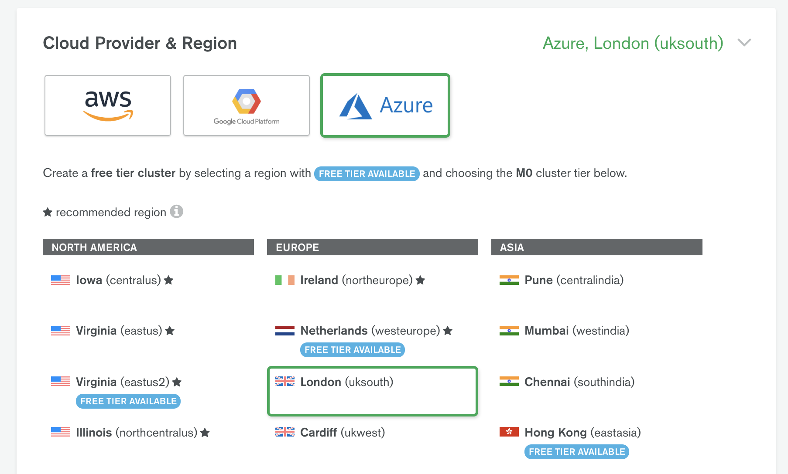
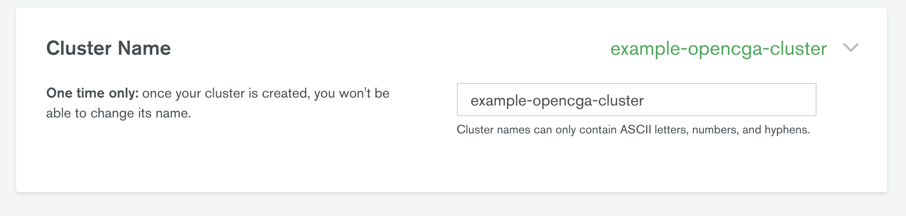
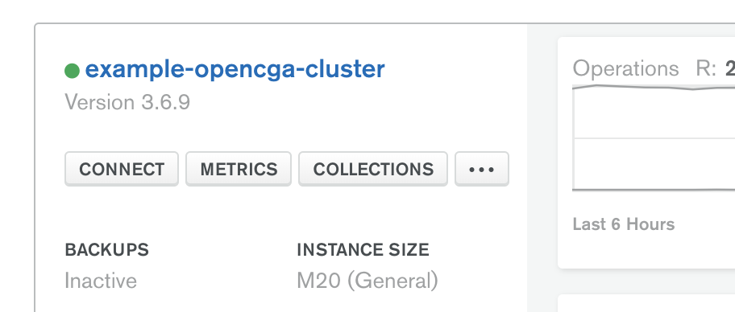

# Using MongoDB Atlas with OpenCGA

If you want to use OpenCGA with MongoDB, but you want to avoid the overhead of managing your own MongoDB cluster, then [MongoDB Atlas] is an potential solution.

[MongoDB Atlas] is an automated cloud MongoDB service, run by MongoDB Inc.

What follows here are some targetted instructions on how to create a MongoDB Atlas cluster, and use it with OpenCGA. If you're looking for a full set of instructions on how to get started you should refer to the official [Getting Started] guide.

## Manual Cluster Setup

### 1. Create an Account, and add a Payment Mechanism
Before setting up a Cluster, you will need to have created an account with MongoDB Atlas, and associated a payment mechanism (a credit card) with that account. While [MongoDB Atlas] supports a free tier, to create a cluster with the appropriate version of MongoDB Server, you will need to use one of the paid-for tiers.

### 2. Create a Cluster

First, select a cloud provider and a region. In this example, we've chosen [Microsoft Azure] and the UK South region within [Azure].



Next, you need to select the size of your cluster. OpenCGA uses MongoDB version 3.6, and so it's necessary to select on of the **Dedicated** plans (the **Shared** plans support MongoDB version 4.0 only). In this example, we've chosen the M20 Tier which is the smallest **Dedicated** cluster size.


Under the *Additional Settings* section, make sure you select "3.6 with WiredTiger(tm)" as the MongoDB version. Here, you can also determine whether you want the cluster to be backed up, as well as some other settings. It's highly recommended that you back your cluster up, unless you're setting up a development system.


Finally, give your cluster a meaningful name.



Once you've supplied all of these values, you can click "Create Cluster" and then wait for the cluster to be provisioned. This can take 5 to 10 mins.

## Configuring OpenCGA to use a MongoDB Atlas Cluster

OpenCGA can use MongoDB for a number of its stores, such as the Catalog. Each of these data stores will need to know where the MongoDB cluster is, and so you'll need to grab the configuration values from the MongoDB Atlas.

### IP White Listing

By default, your MongoDB Atlas Cluster will be behind a firewall that prevents access to the cluster. In order to allow OpenCGA to connect to MongoDB Atlas you will need to either whitelist your IP addresses (recommended) or open your cluster up to *any* IP (not recommended).

Consult the [MongoDB Atlas docs regarding IP White Listing][IP Whitelisting].

### Obtain Connection Details for your Cluster

Once you've created a cluster you can use the MongoDB Atlas site to obtain the connection details required for your OpenCGA installation.

Click the "Connect" button for your Cluster, then click "Connect your Application", and then click "Standard Connection String".



This will give you a connection string similar to the following example:

```
mongodb://azure:<PASSWORD>@example-opencga-cluster-shard-00-00.azure.example.com:27017,example-opencga-cluster-shard-00-01.azure.example.com:27017,example-opencga-cluster-shard-00-02.azure.example.com:27017/test?ssl=true&replicaSet=example-opencga-cluster-shard-0&authSource=admin&retryWrites=true
```

From this connection string you can extract the following:

- the list of hosts within your cluster
- the replica set

With this connection data you can now apply this to your OpenCGA configuration. For example, using the connection string data above, you would set up the OpenCGA Catalog, in `configuration.yml` as shown in the following snippet:

``` yaml
catalog:
  database:
      hosts:
      - example-opencga-cluster-shard-00-00.azure.example.com:27017
      - example-opencga-cluster-shard-00-01.azure.example.com:27017
      - example-opencga-cluster-shard-00-02.azure.example.com:27017
      user: azure
      password: PASSWORD
      options:
        authenticationDatabase: admin
        connectionsPerHost: 20
        sslEnabled: true
        replicaSet: example-opencga-cluster-shard-0
```

Similar configuration could then be applied to other areas of OpenCGA configuration where MongoDB settings are required (e.g. storage)

[Microsoft Azure]: https://azure.microsoft.com/en-gb/
[Azure]: https://azure.microsoft.com/en-gb/
[MongoDB Atlas]: https://www.mongodb.com/cloud/atlas
[Getting Started]: https://docs.atlas.mongodb.com/getting-started/
[IP Whitelisting]: https://docs.atlas.mongodb.com/setup-cluster-security/#add-ip-addresses-to-the-whitelist